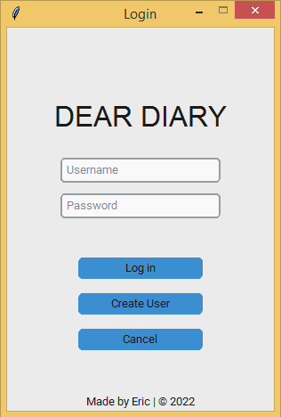
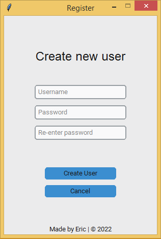

# Dear Diary

Keeping a diary or journal may sound very old-fashioned, something that a Jane Austen heroine would do. It is certainly something that many 
distinguished people, including a number of established writers, have done in the past. It has also featured in literature over many years, 
with famous diary-keepers including Adrian Mole and Bridget Jones.

Keeping a diary has many benefits. These include improving your mental health, as a result of giving you a place to vent your feelings, and 
an ability to process difficult experiences. A diary is also a way to keep track of your feelings and views and how they have changed over 
time, which can be particularly helpful in personal development terms.

For those reasons, I have always wanted to keep a journal myself. However. I always have that hidden fear that someday, someone will have access
to my journal, and all my secrets will be exposed. So I came up with a solution: a personal diary program with log-in mechanism and an encryption
algorithm to keep my thoughts private.

## Description



Program GUI was created using CustomTkinter module for a modern look.

## Getting Started

### Dependencies

To be able to use the program, you should install the following modules:

```
pip install customtkinter
pip install tkinter
pip install hashlib
```

### Installing

To download this program, enter the following command in your terminal:
```
git clone https://github.com/erichoangnle/diary.git
```

### Usage

#### Create new account



Create a new account by providing a username and password. Make sure that you re-enter the same password.

#### Your personal diary


After logging in with valid credentials, you will see the main application window. The features are simple and straightforward. It only includes
the things you need for a personal diary. Nothing more. Nothing less. You can either use the buttons to add date to your entry and save your diary to
a text file or use shortcuts: <Ctrl+D> to add date, and <Ctrl+S> to save your entry.

#### Text encryption


The main feature of this program is encryption. Your entries will be encrypted before saving to file. The encryptiong algorithm utilizes your password 
and uses it as key. Your password is not saved anywhere on the system or the source code. Rather, a hash of you password is saved to database CSV file. Even if 
someone have access to your database file or the source code of the program, he or she shouldn't be able to decrypt your diary.

## Encryption Algorithm

This encryption algorithm works by the principle of Ceasar's cipher, but instead of replacing each letter with a letter some fixed number of positions
down the alphabet, it replaces each letter with an ASCII code a distance N from each character in your password. For example, if the string to be encrypted 
is "Eeny, meeny, miny, moe", and your password is "asd", The first letter "E" will be encrypted to 28, since ASCII value for "E" is 69, and ASCII value for 
"a" is 97, and 97 - 69 = 28. Do the same for each character in string, and once you reached the end character of your password, cycle back to the first 
character of your password. Following is the code for this encryption method:

```
key = [ord(char) for char in password]
encrypted_text = '$'.join([str(ord(text[i]) - key[i % len(key)]) for i in range(len(text))])
```

## Contact

Email: erichoangnle@gmail.com

Facebook: https://www.facebook.com/eric.le.520900

Project link: https://github.com/erichoangnle/diary.git
